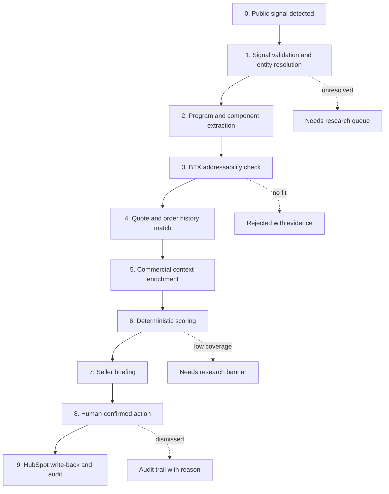

# BTX Omni Prospect - Workflow Spec

**Date:** 2026-08-17
**Purpose:** Design-first artifact per Alan's advice. Documents the console's core workflow end-to-end, and derives from it the data each step needs, from what source, in what shape. Serves as the input to the design brief (extract-ask for Alan) and to the code review (change/delete list for Codex).
**Scoring caveat:** The Account Attractiveness rubric in your working draft is an input to this workflow, not a constraint. Where a step in this workflow surfaces a signal the current rubric doesn't use, or where the current rubric asks for a signal that's structurally hard to source, the rubric is on the table for revision.

---

## The core workflow

The workflow's job is to take one piece of public evidence (a contract award, a program milestone, a regulatory event) and end at either an actionable seller briefing with a concrete next step, or a governed rejection with a reason. Nothing between is a "black box" — every arrow is inspectable, has provenance, and can be challenged.

---

## Step-by-step: data needed, source, shape, current state, gap

### Step 0. Public signal detected
**What happens.** Monitor collects a public event (contract award, expansion announcement, funding action, regulatory event, press release, SEC filing) from the approved source registry.

**Data needed.**
- Source identity (source_system, source_record_id, version)
- Content hash for change detection
- Publication timestamp and collection timestamp
- Raw evidence locator (URL)
- Structured payload where the source provides one (SAM/USAspending JSON, SEC EDGAR filing metadata, agency press-release fields)
- Named entities in the payload (recipient, program, agency, geography, dollar amount)

**Source.** Public feeds via Monitor 2.0 adapters: SAM.gov, USAspending, SEC EDGAR, FDA, NASA, DoD press releases, Federal Register, Commerce Department, state manufacturing publishers.

**Current state.** Fully implemented. `monitor/sources.py` (18 KB), `monitor/usaspending.py` (7 KB with the two-stage award contract), `monitor/repository.py`, `monitor/contracts.py`. Durable persistence for observations, versions, runs, health, clusters, events, rejections. `SourceObservation → NormalizedClaim → IntelligenceEvent` pipeline is real.

**Gap.** None structural. Live collection is disabled by policy (fail-closed until `BTX_MONITOR_MODE=live` and operator token set). Curated public scenarios (`RICH_SCENARIOS` in `providers/research/scenarios.py`, 12 companies) serve as the demo signal set.

---

### Step 1. Signal validation and entity resolution
**What happens.** The signal is normalized into a canonical `IntelligenceEvent`. The named recipient is resolved to a `CanonicalAccount` by legal name, alias, and (for USAspending) recipient legal-name mapping. Unresolved and ambiguous entities are retained as review queue items.

**Data needed.**
- Canonical account master (id, legal_name, aliases, official_domain, industries, public_identity_state)
- USAspending recipient-name mappings for the target companies
- Source-native identifiers when available (CIK, ticker, UEI, CAGE)

**Source.** BTX's normalized data lake will provide the eventual customer master. Today: `docs/research/btx_researched_account_universe.json` (78 researched public companies) plus `btx_usaspending_recipient_identities.json`.

**Current state.** `monitor/resolution.py`, `EntityResolution` in `monitor/contracts.py`, `AccountWatchProfile` in `monitor/resolution.py`. Deterministic exact-name resolution is enabled; alias / ambiguous / unresolved are governed by the common resolver. `provenance.data_mode=CONNECTED` for researched public identity.

**Gap for sample data.** The 78 researched accounts are public-market entities and not weighted toward BTX's actual target customers. When the lake extract lands, the customer master should replace or augment this set with BTX-relevant customers. **This is one of the drivers of the "overly general accounts" delete/replace decision in the code review step.**

---

### Step 2. Program and component extraction
**What happens.** Given a signal that mentions a program (e.g. "NASA CLPS providers," "F-35 Lot 18," "NXE:3800 lithography system"), extract the program name, program type, and any component classes referenced or reasonably implied.

**Data needed.**
- Program vocabulary per industry (per `monitor/packs/` industry-pack configs)
- Component-class taxonomy (BTX-relevant part families: enclosures, housings, brackets, machined structural parts, precision-tolerance parts, etc.)
- Signal payload (title, description, structured fields where the source provides them)

**Source.** Signal payload is public. Component-class taxonomy needs BTX input.

**Current state.** `monitor/normalization.py` and `monitor/ontology.py` handle signal normalization. `monitor/packs/__init__.py` (1.7 KB) declares industry packs. `ProgramResolution` in `monitor/contracts.py`. LLM-assisted extraction of component classes is not yet wired; this is where the AI provider question intersects.

**Gap.**
- Component-class taxonomy for BTX is not defined in code. The `domain/programs.ComponentClass` dataclass exists but no seeded taxonomy.
- LLM extraction of components from award descriptions is Kapil's original monitor workflow (per Alan call). Currently the console's LLM path (`ai/anthropic.py` / `assistant/orchestration.py`) is only wired for Omni Q&A, not for structured component extraction. **New pipeline needed: `modules/extraction/components.py` that takes a signal and returns candidate ComponentClass records with evidence.**
- Governance: LLM extraction must be deterministic-first (regex/pattern match on known program vocabularies) before falling back to LLM inference, per your provenance discipline.

**Sample data implication.** Sample dataset needs seeded programs (e.g. NASA CLPS, F-35, NGAD, CHIPS-Intel expansion, ATLAS-V ULA, Starship, ITER, cell manufacturing) and seeded component-class taxonomy tied to those programs. Currently the sample has `sim-program-lockheed` and `SIM-100` placeholders. These are the "overly general" placeholder-ness that should be deleted in favor of real program names with real component classes.

---

### Step 3. BTX addressability check
**What happens.** Given a candidate program and its component classes, ask: does BTX build things like this? For which BUs? At what volumes? Does BTX have relevant certifications?

**Data needed.**
- BTX capability catalog (per BU: materials, processes, tolerances, certifications, volume ranges).
- Historical quote metadata from Paperless (part_family × material × process × BU) as the strongest evidence of "we've done work like this."
- BTX facility list (already in `AccountFacility.BtxFacility` domain).

**Source.** BTX capability catalog needs BTX input. Paperless for quote history. BTX facility list from BTX.

**Current state.** `domain/capabilities.Capability` stub exists (200 bytes, empty). `BtxFacility` dataclass exists but no seeded content beyond `BTX Southwest` hardcoded in `api/map.py`. `modules/matching/commercial.py` implements structured matching but only against `HistoricalQuoteContext`, which is one synthetic Lockheed record in the current sample.

**Gap.**
- No seeded BTX capability catalog. This is the second biggest sample-data gap after the customer master.
- No seeded BTX facilities beyond one Phoenix pin.
- Matching engine has only one historical quote to match against.

**Sample data implication.** Sample dataset needs (a) a real BTX capability catalog per BU (5-10 BUs × 20-30 capability tags), (b) BTX facility list with real cities/regions (Phoenix, wherever else), (c) a meaningful set of historical Paperless quotes (say 50-200 quotes across the 12 curated scenarios, with realistic part_family / material / process / status distributions). Currently there are ~13 quotes in the sample.

---

### Step 4. Quote and order history match
**What happens.** Given the addressability check passed, look at BTX's actual history with this customer × BU: prior quotes, prior orders, prior wins, prior losses, current open quotes, quote-to-book conversion rate.

**Data needed.**
- Paperless quote records for this customer × BU (all statuses).
- Data-lake orders and bookings for this customer × BU (trailing 12+ months).
- Quote-to-order linkage (which won quotes converted to orders, at what value, on what timeline).

**Source.** Paperless for quotes, data lake for orders and bookings.

**Current state.** `domain/quotes.CommercialQuote` and `PaperlessAccount` shapes exist. `domain/commercial.CommercialContext` and `MonthlyCommercialHistory` shapes exist. All populated in-memory only in `providers/sample/environment.py`. No persistence, no repository for either.

**Gap.**
- No `commercial_quotes`, `paperless_accounts`, `commercial_contexts`, `monthly_commercial_history`, `orders` tables (called out in audit section 5).
- Quote-to-order linkage is not modeled at all. Domain has `quote_to_book_evidence_ids` as an opaque tuple; no shape for orders that references quotes.

**Sample data implication.** The reshape has to introduce orders, wire quote-to-order linkage, and persist. This is the "closer to real data lake shape" work.

---

### Step 5. Commercial context enrichment
**What happens.** Assemble the commercial context around this account × BU: TTM revenue, TTM bookings, last booking date, last order date, monthly trend, ownership in HubSpot, open HubSpot deals, last meaningful contact activity.

**Data needed.**
- Data-lake aggregates (customer × BU × month, TTM roll-ups, last-dates).
- HubSpot company, contacts, deals, activities, owner directory.
- Owner mapping between data-lake customer_id and HubSpot company (this is a mapping BTX will need to maintain).

**Source.** Data lake for financial context, HubSpot for CRM context.

**Current state.** `SampleCrmContext` is a thin stand-in that doesn't populate the richer `CrmCompany`/`CrmContact`/`CrmDeal`/`CrmActivity` dataclasses. HubSpot MCP is connected in this session but not wired.

**Gap.** Covered in audit section 7d. Read side of HubSpot needs to be wired first per revised P0.1a.

---

### Step 6. Deterministic scoring
**What happens.** Run the Account Attractiveness rubric with all six factors: program durability, BTX manufacturing fit, addressable BTX work, program momentum, strategic target fit, BTX commercial adjacency. Return score, coverage, per-factor contributions, missing signals.

**Data needed.**
- All the outputs of steps 1-5, mapped to the rubric's expected input keys.

**Source.** Composed from prior steps.

**Current state.** `modules/scoring/account_attractiveness.py` is a full implementation of the working-draft rubric. Weights, bin definitions, missing-data reweighting, factor contributions — all present. The `INTERPRETATION_NOTE` explicitly flags missing-subfactor reweighting as pending Jamie calibration.

**Gap where the workflow challenges the current rubric.**
- **Signal-provenance strength is not a factor.** Two accounts can produce identical scores while one is backed by a SAM.gov contract award and the other by a company press release. The workflow reveals that "which source produced the evidence" materially affects trust. Consider a Signal Confidence factor or a rubric-level provenance multiplier. Your scope doc's second-tier "Signal Confidence" score is exactly this; the workflow argues for pulling it forward into Account Attractiveness, or wiring it as a top-level display next to attractiveness.
- **Facility proximity is currently excluded from scoring** by explicit policy (`api/map.py` says "Seller planning input only; never an attractiveness input"). The workflow supports this policy but the sample data should demonstrate it visibly.
- **Time-decay on program momentum.** The rubric bins momentum as "recent 6 months" but the workflow surfaces evidence from a range of dates. Consider explicit time-decay so a 5-month-old award scores less than a 2-week-old award without needing to change bin definitions.
- **Cross-BU applicability signal is weak.** Currently binned as TWO_PLUS_BU / ONE_BU / WEAK / MISSING. The workflow will make it more useful if it's derived from actual data-lake evidence of active TTM revenue in more than one BU, rather than a manual selection.

None of these are urgent code changes. They are candidates for the rubric revision conversation with Jamie once sample data is real enough to test against.

---

### Step 7. Seller briefing
**What happens.** Render the priority card in Today: what happened, who it involves, why it matters to BTX, what score coverage looks like, what evidence is missing, what the recommended next step is.

**Data needed.**
- Score result, top drivers, missingness list.
- Evidence chain (source URLs, evidence states, verification states).
- Recommended action text (deterministic template based on scenario type).
- HubSpot owner / next-step candidate.

**Source.** All prior steps.

**Current state.** `api/today.py` returns priority_intelligence, commercial_alerts, recommended_actions. Frontend renders in `features/today/Today.tsx`. Alerts engine in `modules/alerts/commercial.py` covers CUSTOMER_INACTIVITY, BOOKINGS_DECLINE, STALE_QUOTE, QUOTE_FOLLOW_UP, CRM_INACTIVITY, CROSS_BU_COORDINATION, INTELLIGENCE_COMMERCIAL_CONTEXT, and (pending order data) OVERDUE_ORDER.

**Gap.** Recommended-action templates are minimal. The scenario types in `providers/research/scenarios.py` map to `recommended_next_step` strings, but the templates are generic ("Review the public source and identify the appropriate procurement role target"). Real seller briefings need specific next-step guidance tied to the scenario (call the buyer, submit a follow-up quote, add to portfolio review, escalate to BU manager). This is a content problem more than a code problem, but it becomes obvious when sample data is rich enough.

---

### Step 8. Human-confirmed action
**What happens.** Seller reviews the briefing, decides whether to advance, dismiss, assign, or follow up. Every state change is audited. No autonomous CRM writes.

**Data needed.**
- Action templates (review, assign, approve, dismiss, follow up, CRM action).
- Actor identity (development-only auth today).
- Idempotency key (already required in `domain/work.GovernedAction`).

**Source.** Console-owned.

**Current state.** `modules/work/service.py`, `api/actions.py`, `SampleHubSpotAdapter.preview_action` / `execute_action`. Persistence is session-memory only (called out in `SELLER_POC_OPERATION.md`).

**Gap.** Session-memory persistence is a real gap for demo credibility. Users will notice actions disappear on restart. P2 in audit.

---

### Step 9. HubSpot write-back and audit
**What happens.** On confirmed CRM action, push the change to HubSpot (activity log, note, deal-stage advance, company-property update) with a `source: console-enriched` marker and a durable audit event in `work_audit_events`.

**Data needed.**
- HubSpot object IDs (company, deal, contact) from the read side.
- Field-ownership policy (which properties the console is allowed to write).
- Console action metadata (evidence chain, action_id, actor_id, timestamp).

**Source.** HubSpot MCP for the write. Postgres `work_audit_events` for the audit.

**Current state.** Write seam exists (`execute_action`) but is a stub. `work_audit_events` table exists. Field-ownership policy does not exist.

**Gap.** Covered in P0.1b in the audit.

---

## Cross-cutting: what the workflow makes concrete for sample data

The reason to run this workflow spec even though most of the code exists is that it exposes what the sample data needs to look like for the workflow to feel real. Here's the extracted requirements list:

1. **Customer master (~50-100 records, BTX-weighted).** Real companies BTX actually cares about, not a generic public-market universe. Replaces or heavily augments the 78 researched-only universe.
2. **Program catalog (~20-40 real programs).** Real names: F-35, NGAD, NASA CLPS, NASA VADR, CHIPS-Intel, Starship, ATLAS-V, ITER, whatever medical device platforms matter. Currently mostly placeholder strings.
3. **Component-class taxonomy (~20-50 classes).** Real machining families: precision-machined enclosures, structural brackets, tolerance-critical housings, etc. Currently empty.
4. **BTX capability catalog (per BU: materials, processes, tolerances, certifications, volume range).** 5-10 BUs × 20-30 capability tags. Currently empty.
5. **BTX facility list.** Real cities, real capability tags per facility. Currently one Phoenix pin.
6. **Historical quote set (50-200 quotes).** Realistic part_family / material / process / customer / status distributions across the customer master. Currently 13 quotes.
7. **Order set (50-200 orders).** Transaction-level with part_number, promised date, actual ship date, status. Currently zero.
8. **Data-lake commercial rows.** Customer × BU × month for revenue and bookings, 24 months of history. Currently one to two months of monthly_history per curated scenario.
9. **CRM population.** Real-shaped HubSpot company/contact/deal/activity records per customer. Currently thin `SampleCrmContext` stubs.
10. **Cross-account edges** (the relationship matrix, once modeled). Shared contacts, shared programs, shared orders, parent-child, competitor-on-program.

Items 1-3 are the biggest source of "overly general" feel in the current sample.

---

## What this makes concrete for Alan

Rather than a speculative field list, the design brief (next deliverable) asks Alan for exactly what the workflow needs:

- **From the normalized data lake:** a sample extract sized around a small number of BTX customers (Alan offered ~100 records). Fields drive from step 3, 4, 5: customer identity, BU, monthly revenue/bookings/orders, per-transaction order details, last-booking/last-order dates.
- **From BTX subject-matter experts (Jamie plus BU leads):** the capability catalog and facility list, in a spreadsheet form. This isn't a lake extract; it's a knowledge extract.
- **From Paperless:** deferred until CUI handling is answered. For now, sample data is shaped after the Paperless public API model.
- **From HubSpot:** deferred until BTX HubSpot is authorized. For now, Kapil's personal HubSpot is the target for the bidirectional demo.

The design brief formalizes this ask.

---

## What this makes concrete for Codex (change/delete list preview)

Not the full code review yet, but the workflow points at these code changes:

- **Delete:** placeholder scenarios' `sim-program-*` and `SIM-100` synthetic identifiers. Replace with real program IDs from the program catalog seed.
- **Delete:** if there are auto-generated or overly generic account records beyond the 78 researched (needs verification in the code review pass; the ingestion module claims only 78 exist, but the "600 overly general" you flagged suggests a leftover generator or fixture file somewhere I haven't found).
- **Add:** `docs/research/btx_program_catalog.json`, `docs/research/btx_component_taxonomy.json`, `docs/research/btx_capability_catalog.json`, `docs/research/btx_facility_list.json`, `docs/research/btx_customer_master.json`.
- **Add:** Alembic migration `0008_commercial_tables` with programs, component_classes, commercial_contexts, monthly_commercial_history, commercial_quotes, paperless_accounts, orders, and account_relationship_edges (from audit sections 5 and 8).
- **Add:** `providers/lake_sample/` module that models rows in long form (`customer_bu_month`) plus `orders_transaction` shape.
- **Change:** `providers/sample/environment.py` to compose from the new lake_sample module and populate the richer CRM dataclasses using HubSpot-default properties.
- **Change:** `modules/extraction/components.py` (new) to run deterministic component extraction from IntelligenceEvent payloads, with LLM fallback via the provider abstraction.

The full change/delete list comes in the code review deliverable, anchored to this workflow.

---

## Next

1. Draft the design brief (with you) that translates this workflow into the concrete extract-ask for Alan and the seed-data ask for Jamie / BU leads.
2. Do the code review (with an explicit hunt for the "600 overly general accounts" you referenced).
3. Execute the sample-data rebuild against the change/delete list.
